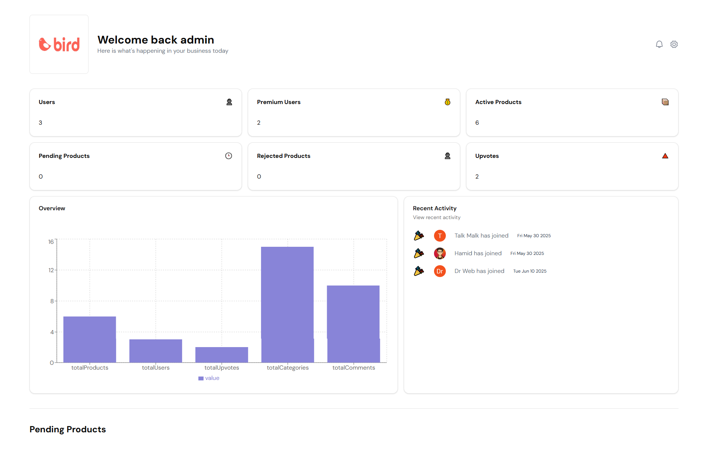
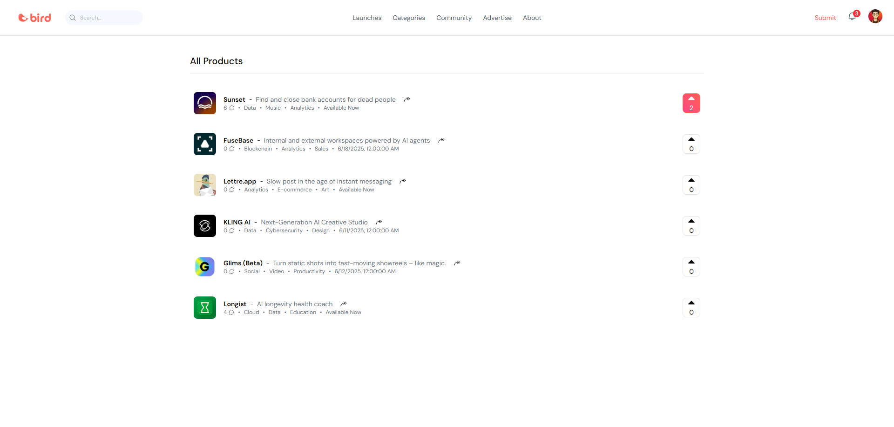
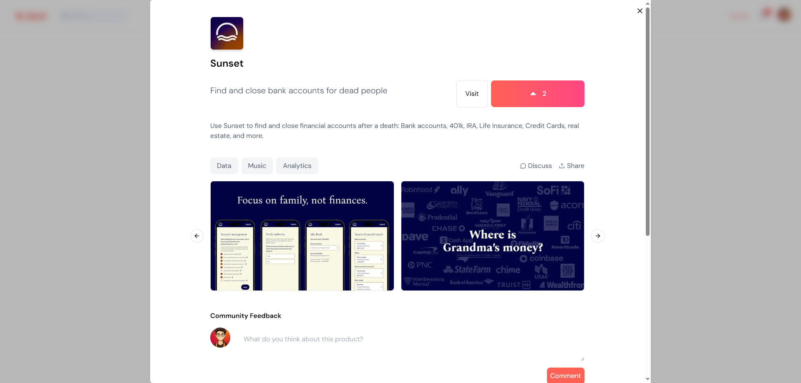
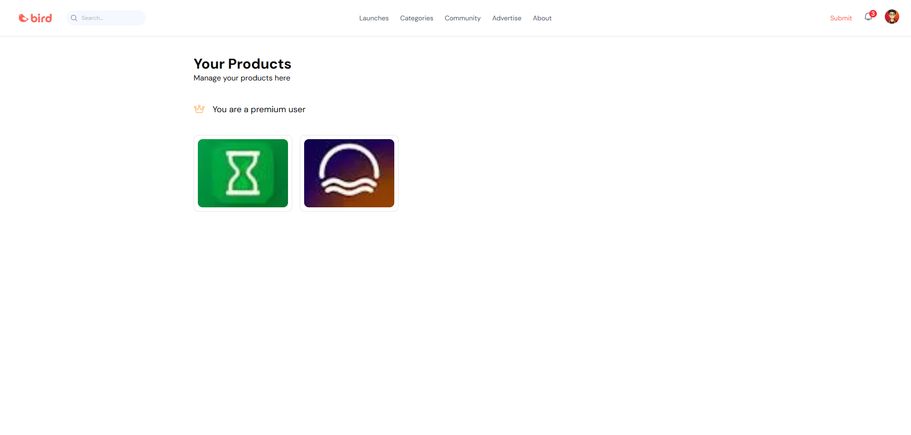
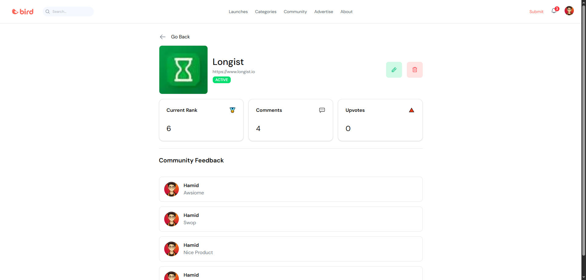
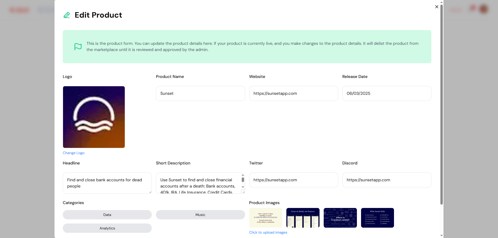
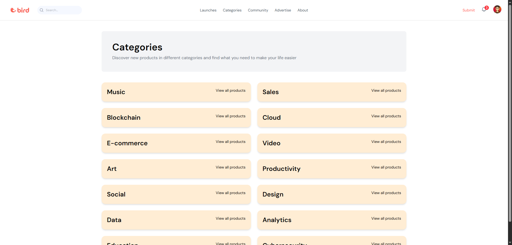
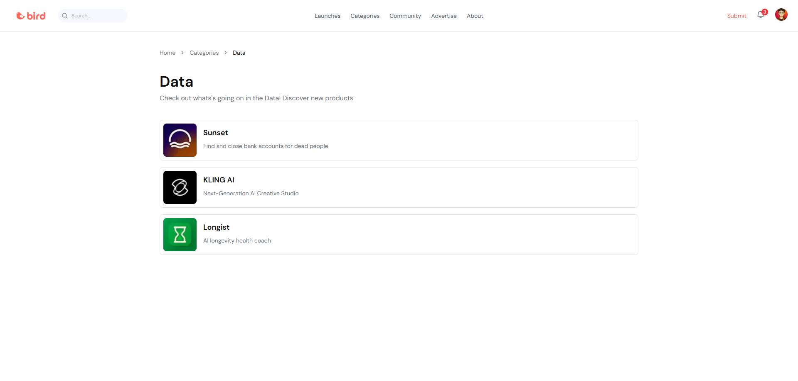
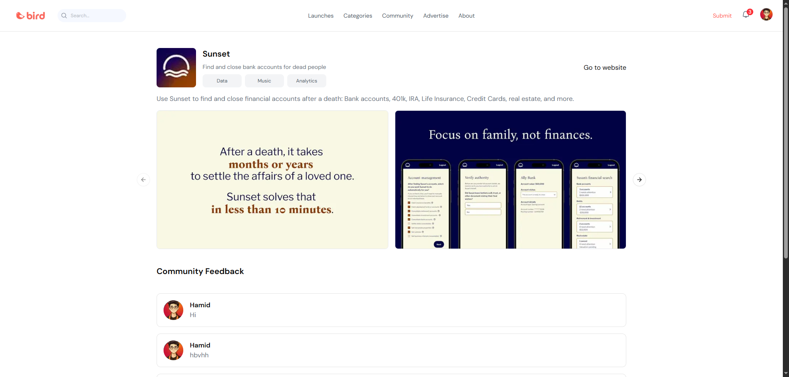

# 🚀 Product Hunt Saas

### Admin Dashboard



| 🟢 Live Preview |  |
|------------|------|
| [Visit](https://product-hunt-clone-pi.vercel.app) 

## 🛠️ Tech Stack

- ⚡️ [Next.js 14](https://nextjs.org) - The React Framework for Production
- 💳 [Stripe](https://stripe.com/connect) - Payment processing
- 🗃️ [Prisma](https://www.prisma.io) - Next-generation ORM
- 🐬 [PostgreSQL](https://www.postgresql.org) - Database
- 🎨 [Tailwind CSS](https://tailwindcss.com) - Utility-first CSS framework


## ✨ Features

- 🔐 Authentication with NextAuth.js
- 👤 User profiles and settings
- 📱 Responsive design for all devices
- 🎨 Modern UI with Tailwind CSS
- 💳 Stripe integration for payments
- 📊 Product submission and management
- 👍 Upvoting system
- 💬 Comments and discussions
- 🔍 Search functionality
- 📱 Mobile-first approach
- 📈 Analytics dashboard
- 🔔 Notifications
- 🏷️ Product categorization
- 📱 Social sharing
- 🔒 Role-based access control
- 📊 User activity tracking
- 🎯 Product discovery


## 📸 Screenshots

### Landing Page


### Product Details




### My Product Submissions



### My Product Info



### Edit Product



### Categories Page



### Single Category Page


### Single Product Page


## 🚀 Getting Started

1. Clone the repository
2. Install dependencies:
```bash
npm install
```

3. Set up your environment variables:
```bash
cp .env.example .env
```

4. Start the development server:
```bash
npm run dev
```

5. Open [http://localhost:3000](http://localhost:3000) with your browser to see the result.

